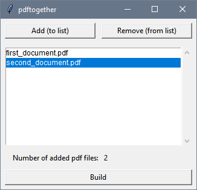

# pdftogether

*pdftogether* is a simple tool written in Python 3 for merging several pdf files into one file.

## Why?

From time to time I need to merge two or more pdf files into one. It doesn't make sense to have every page of a document in a seperate file. Windows doesn't support such operation out-of-box, nor the most popular pdf readers. As the app I had been using for a while doesn't seem to be updated anymore, I decided to create such pdf merging app by myself, keeping it as simple as possible.

## Installation

*pdftogether* requires Python 3 to run it, that's first prerequisite. I'll refer to Python 3 later simply as Python, so keep this in mind. *pdftogether* was tested on Python 3.11.5, but it should be fine with any future versions for a while.

The same rule applies to *pypdf* package, but I recommend using it in version I used, that's *pypdf 3.16.2*. I refer to this version in instructions below.

### On Windows

After having Python installed (if you don't have it yet, you can find it [there](https://www.python.org/downloads/)), you just need to install one extra package from *pip* by typing in cmd/PowerShell/Terminal:

```
py -m pip install pypdf==3.16.2
```

Then you just need to get *pdftogether.pyw* file from this repository. You may run it by just double-clicking on file.

### On Linux

On most Linux distributions Python is already installed, but it requires a few more steps as *tkinter* and *pip* are not installed along with Python. I will use Ubuntu 22.04.2 as an example there.

Ubuntu has Python installed by default, so start with installing *tkinter* for GUI by typing in Terminal:
```
sudo apt-get install -y python3-tk
```

Then install *pip*, a package installer for Python the same way:
```
sudo apt-get install -y python3-pip
```

After that get *pypdf* - the only package from *pip* required for *pdftogether.pyw*:
```
python3 -m pip install pypdf==3.16.2
```

Then all that is left is to download *pdftogether.pyw* from this repository and run it.

## How to use



To add file to list - just click on *Add (to list)* button at the top, then select a file from new window and click *Open* button. Now it should appear on list with files in main window of *pdftogether*.

To remove file from list - select filename on list in main window of application and click on *Remove (from list)* button at the top of the window.

To merge pdf files - after adding files in the correct order to the list click on *Build* button on the bottom of window, then select a place where you'd like to save a new file (you can also change its name at this point) in a new window and click *Save* button.

## Credits

This application is based on following open source software:
- [Python](https://www.python.org/)
- [pypdf](https://github.com/py-pdf/pypdf)
- [Tcl/Tk](https://www.tcl.tk/)

## Licence

pdftogether is licensed under the terms of the MIT License.